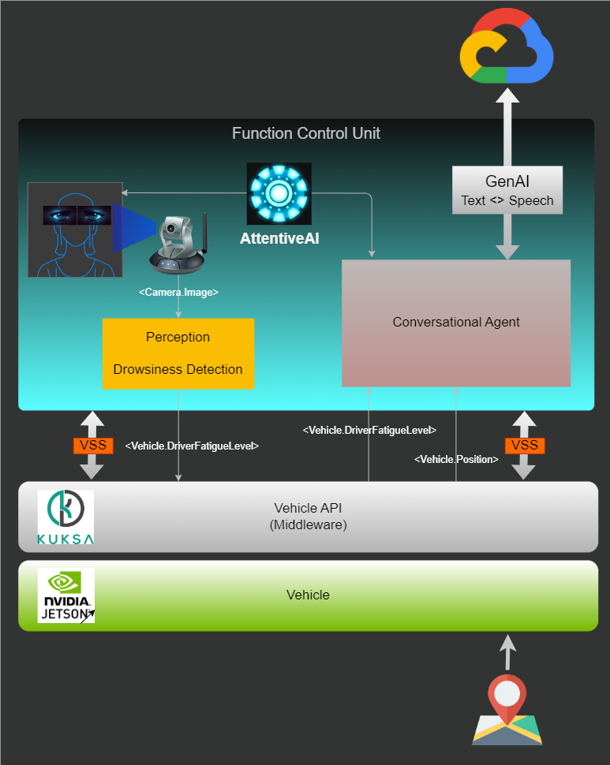

# AlpacAI

<p align=center>

</p>

## Table of Content

- [AlpacAI](#alpacai)
  - [Table of Content](#table-of-content)
  - [Problem Statement](#problem-statement)
  - [Vision](#vision)
  - [Future Directions](#future-directions)
  - [Conceptual System Architecture](#conceptual-system-architecture)
  - [Prerequistes](#prerequistes)
    - [General](#general)
    - [Development](#development)
  - [Installation](#installation)
    - [Environment](#environment)
    - [Application](#application)
  - [Usage](#usage)
  - [License](#license)

## Problem Statement

AlpacAI represents a cutting-edge integration of AI technologies with automotive safety systems, designed to redefine the driving experience. At its core, AlpacAI leverages advanced machine learning algorithms, natural language processing, and computer vision to monitor driver attentiveness and provide interactive assistance. By ensuring that drivers remain focused and alert, AlpacAI aims to significantly reduce the risk of accidents caused by distractions.

## Vision

AlpacAI aims to gamify driver experience and ensure road safety by embedding intelligence and attentiveness into every journey. By combining AI's predictive capabilities with real-time monitoring and intervention, AlpacAI not only makes driving safer but also more enjoyable and engaging. It represents a significant step forward in our journey towards fully autonomous vehicles, offering a glimpse into the future of intelligent transportation systems.

## Future Directions
The project envisions expanding its capabilities to include predictive accident avoidance, integration with smart city infrastructure for optimized routing, and enhanced personalization features that adapt to each driver's unique preferences and driving patterns. AlpacAI is not just a project; it's a commitment to safer, smarter, and more connected driving experiences.

## Conceptual System Architecture

<p align=center>

</p>


## Prerequistes

### General
* Linux Ubuntu 22.04
* `python` > 3.10+
* `gcloud` (See [gcloud installation](https://cloud.google.com/sdk/docs/install?hl=de#deb).)
* `portaudio`  
  ```commandline
  sudo apt install portaudio19-dev python3-all-dev
  ```

### Development

* Docker (Desktop)
* Your favourite IDE
* Your motivation :smiley:

## Installation

First thing to do is to clone our repository

```shell
# Clone the repository
git clone https://github.com/afri-bit/AlpacaAI.git

cd AlpacAI

```

### Environment

Within this project we are providing you a isolated environment using Docker containerization technology. Make sure you have your Docker installed on your local machine, and follow the instruction below.

```shell
# Assuming you are already inside the project root folder

cd docker

# Building the docker image, in case you haven't
docker compose build

# Run the container
docker compose run alpacai
```

### Application

```shell
# !!! Assuming you are inside the docker container and have the project folder mounted inside the container !!!

# Setup the python virtual environment
python -m venv .venv

# Activate the virtual environment
source .venv/bin/activate

# Install the requirements
(.venv) pip install -r requirements.txt

# Install python package
(.venv) pip install .
```

## Usage

```shell
# Available commands
convagent --help
  usage: AttentiveAI [-h] [-vip VEHICLE_IP] [-vp VEHICLE_PORT] [-s] [-cp CONFIG_PATH]
  
  Intelligent driver drowsiness avoidance with GenAI
  
  options:
    -h, --help            show this help message and exit
    -vip VEHICLE_IP, --vehicle_ip VEHICLE_IP
                          IP address to the vehicle interface communication
    -vp VEHICLE_PORT, --vehicle_port VEHICLE_PORT
                          Port communication to the vehicle
    -s, --simulation      Simulation Mode ON
    -cp CONFIG_PATH, --config_path CONFIG_PATH
                          Path to JSON file

# Subscribe to KuksaVal and activate Conversation Agent to assist the driver
convagent -vip <IP_addr> -vp <Port>

# Run simulation from sample JSON
convagent -s
```

## License

AlpacAI
