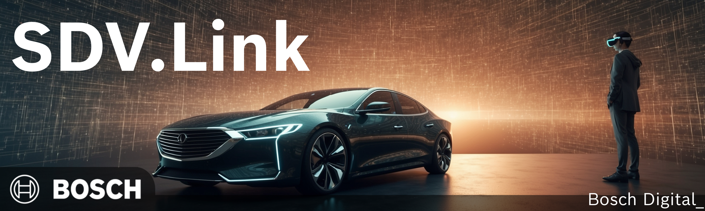
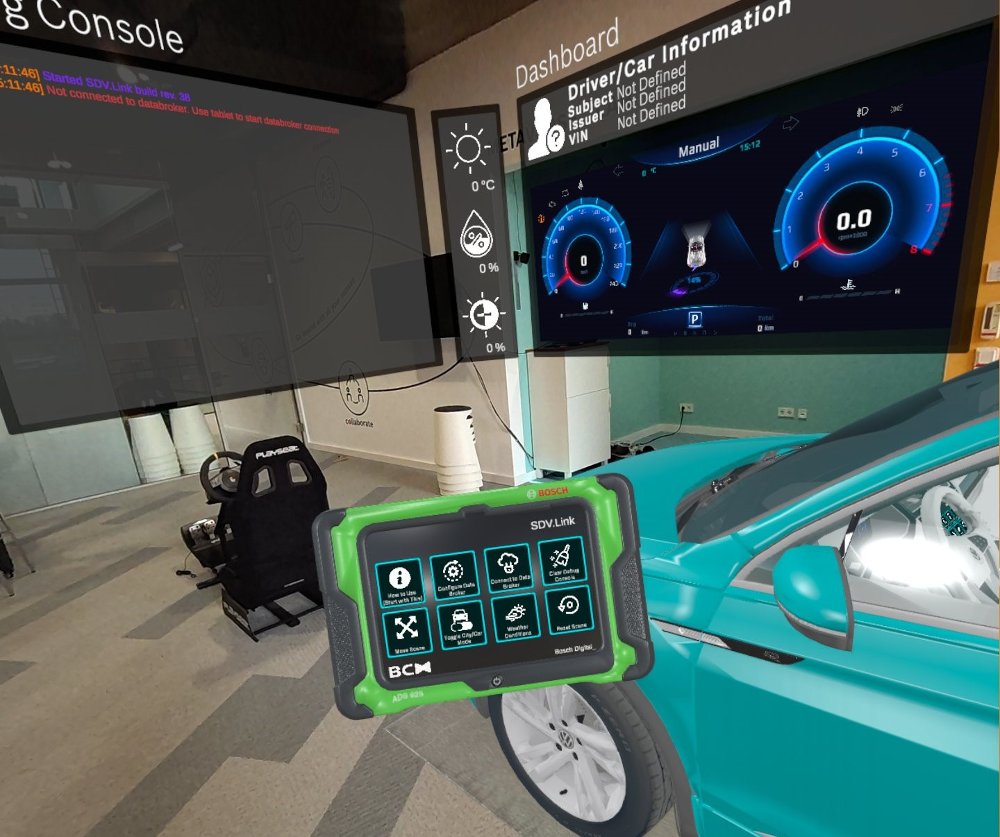
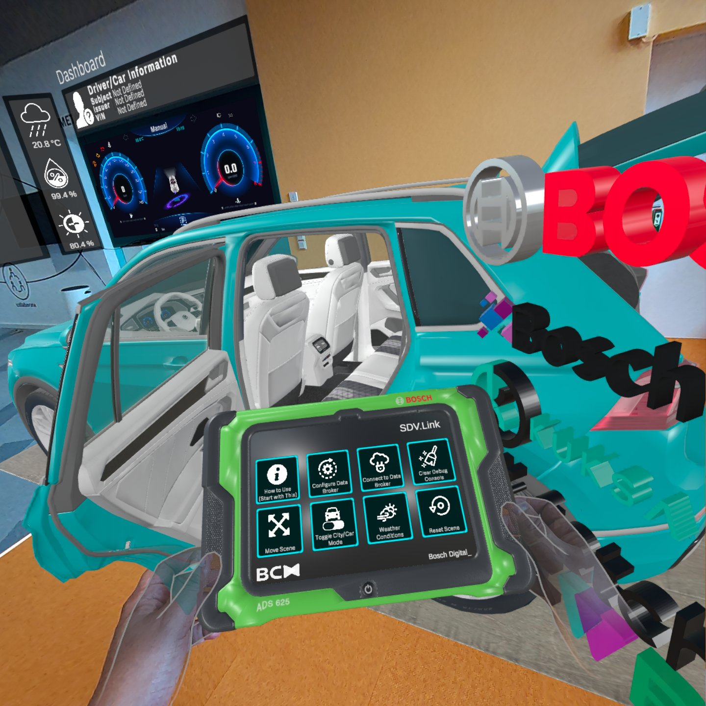
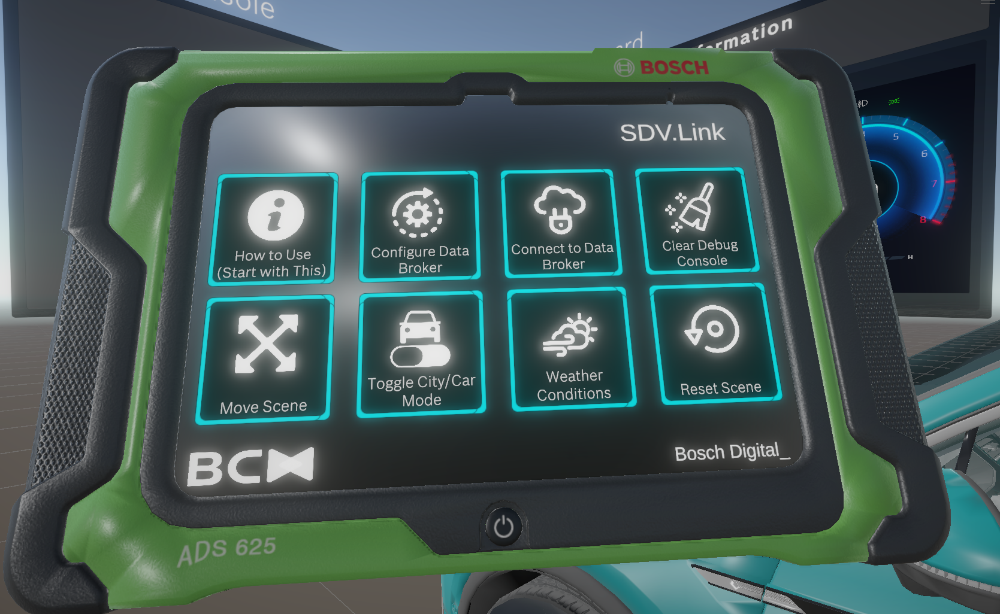
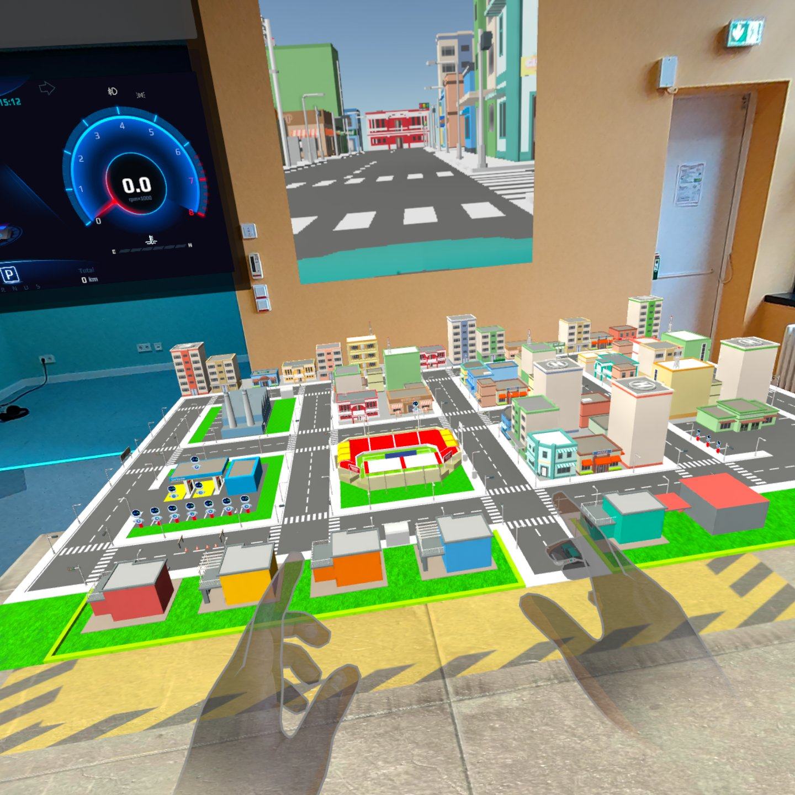

# SDV.Link Mixed Reality Kit

## Introduction

The SDV.Link App is an app preloaded on our VR headsets available at BCX (Meta Quest 3, Meta Quest 2 and Meta Quest Pro).

It is a controller-free application which visualizes and virtualizes a Virtual Car as well as a Mini map representing a Virtual City.

You're provided with an immersive environment with which you can develop car apps in lieu of an actual physical vehicle.

<video width="auto" height="700" controls> 
    <source src="img/sdvlink-video1.mp4" type="video/mp4">
</video>

## What does it do and how does it work?

With SDV.Link, you are able to write applications based on Covesa and VSS signals. Applications emitting supported signals (listed below) can manipulate and visualize both the Virtual Car and how it works around the Virtual City.

Interacting with the Virtual Car (e.g. opening doors, toggling switches, collisions to builidngs etc) also emits VSS signals so that your applications can react to these signals and write your use-cases.

XXX IMAGE OF CAR AND CITY XXX

## Is that all? What else is provided? What can i do with these?

So here is what is provided for you in order to take advantage of the SDV.Link app.

XXX IMAGE: ARCHITECTURE DIAGRAM XXX

**The SDV.Link App**
The Mixed Reality application which runs on our headsets available at BCX.

**SDV.Link Companion App**
This is a python-based app which acts as a keyboard car controller. For one, It allows you to use WSAD keys for example for driving around (i..e emitting signals which tasks the car to move forward, back, etc). This is best paired with the SDV.Link VR App when used in City Mode. This will allow you to control the Mini City car and drive around the city. In turn, whatever events occuring within the city is also reported back (for example a car crash emits the IsBrokenDown signal). FUN!!|

XXX IMAGE CAR CONTROL XXX

**Fetch.AI Cloud and Local Agent**
This is a pair of agents (One running on Fetch.AI and its DeltaV service) and the other is an agent which runs close to your broker (More about the broker later below). With such a setup you can have agents running on the cloud be able to communicate to your local setup. For example via DeltaV, you can use the LLM Chat service to send VSS commands to your vehicle. Not happy with that? Extend the code to put some fancy features in between!

XXX IMAGE DELTAV SCREENSHOT XXX

**Smart Contracts**
There are some points in the Virtual City where it emits signals in order to perform payments. Maybe you can write a payment Smart Contract? Or maybe tap on the various other signals instead? (e.g. if the car breaks down, make a payment to a towing company and send for help!)

XXX IMAGE VIRTUAL CITY PAYMENT RESPONSE VIZ XXX

**The SDV Technology Stack**
This is a sizeable amount of frameworks and tools for you to write your applications such as Velocitas, Kuksa, Kuksa SDKs

**Any Covesa-compatible Hardware**

We provide, for example an actuating Smart Seat. The seat provides a Seat Service which you can develop apps against. Our Virtual car also has seats which are moveable, so you can have the seat move in the real and virtual at the same time. Imagine the next cool Passenger Welcome Use-case?

We recommend reading up on Covesa. The VSS signals we support (meaning which you can subscribe and set values to), are listed below: 

XXX TODO LINK TO VSS TABLE XXX

## Getting up and running

Before you run the SDV.Link XR App, its useful to ensure you've your development environment setup.

Depending on what you want or need you might want to refer to our other documentation pages (e.g. Velocitas) to setup your environment. Minimally, you would need to run the Kuksa Databroker, which is conveniently available as a Docker Container as well as Python.

Kuksa has also non-python SDKs available. If that's your poison, knock yourself out!

XXX LINKS XXX

## Running a compatible stack or server (e.g. Kuksa DataBroker)

The simplest way? Install docker and run the following command.

docker pull ghcr.io/eclipse/kuksa.val/databroker:0.4.1

Then run the container, exposing and mapping to port 55555

You can also deploy the container to any cloud Docker services (e.g. Azure Container Instances).

If you're running one of our prebuilt setups  (e.g via Eclipse Leda, etc), you are already running a Kuksa Databroker. You can reuse this.

## Install and Test the Kuksa Client

Now that you've your DataBroker up and running, how do you know its working?
We will install the Kuksa Client, connect it to our broker and run some simple commands.

The Kuksa Client https://pypi.org/project/kuksa-client/ can be installed via pip

pip install kuksa-client

After installing, and you have your databroker running on your localhost on port 55555, you can simply run:

> kuksa-client

If your broker lies elsewhere, you will have to specify the URI to it, for example:

> kuksa-client grpc://ip-address-or-host:55555

If all goes well, you should see a message that your kuksa client has connected.

The Kuksa Client is your best friend for debugging, sending commands and to subscribe to incoming signals.

Some useful commands you can use with Kuksa Client

> Set Value
>
> Get Values
>
> Subscribe to Values

### Grab your VR and Set up the Guardian/Boundary

Now that you've your broker up, let's get on with the fun stuff!

Find a VR headset at BCX and put it on!

To get the best comfort, you might need to adjust the Inter-pupiliary Distance (IPD) so as to get the best comfort for your eyes.

Next, you will need to specify a Guardian. A Guardian is basically a virtual area which you can specify so that the XR app can show the virtual environment in and by which you can walk around. It also ensures that you're within this area and that you don't walk out of it for safety reasons.

Take a look here or find one of our Hack Coaches if you need an assist.

https://www.meta.com/en-gb/help/quest/articles/in-vr-experiences/oculus-features/boundary/

XXX NOTE: ALWSYS BE CAREFUL AND AWARE OF YOUR SURROUNDINGS. It would be great if you have a buddy who is also watching over you XXX

## Run the SDV.Link App

When you're golden with the Guardian/Boundary, it's time to launch the app.

Since the app supports 100% hand-tracked controls, you don't need the Meta Quest controllers. So you can put that away.

#### The Oculus Menu ####

A useful function to take note of is the ubiquitous Oculus Menu. Its a menu which has some basic functions which could be useful.

See https://www.youtube.com/watch?v=a0cfmOyLeo4

Two of the features which are useful are the one to re-center youself (in case the environment ever is in a weird state) and the recording feature which would be great if you want to record your pitches (....or just for fun and giggles.). Approach our Hack Coaches if you need to retrieve the images and videos recorded from our devices.

As soon as you're ready, find the SDV.Link app icon and tap to launch.

After a while, you should find that the mixed reality environent loads up and you should see the Virtual Car, Virtual Tablet and Virtual Dashboard and Debug Consoles.

## Getting around the app

#### Moving around and interacting

In order to get around, simply walk around the scene. The space you're allowed to walk around would be based on how large the boundary or guardian you've set up.

if you find that you're walking into interesting areas of the XR scene and they disappear (you should see a virtual wall before that happens), you would need to define a larger boundary.

XXX VIDEO GUARDIAN WALL XXXX

Various objects can be directly interacted with. (For example the Virtual Tablet, Logos, the car doors and trunks). At this point, you should be able to see a "ghost" virtual hand overlaid on your own. You can just reach out and grab or use your finger to press/tap on elements of the scene.

#### The Virtual Console

The Virtual Console is located on the left and shows every pertinent messages during the running of the app. You can see any VSS signals coming in or going out, error messages or notifications.

#### The Virtual Tablet

The Virtual tablet is a very useful and important tool. Its the interface to working with some of the feature of the scene.
One of the most important is to connect/initiate a connection to the data broker.

The same Virtual Tablet interface can also be found within the Virtual Car's HMI dashboard.

##### Configuring and Connecting to your broker

Tap on Configure DataBroker and then tap on the hostname field. You should see a virtual keyboard pop up.

Fill in with your databroker host and port (typically 55555) and then hit save and then connect.

In case you do not have a databroker up yet, you can click on the Test Demo Databroker button to try out the app with our test cloud databroker.

Be warned though, the test databroker is not designed for multiuser use. So if multiple users use the broker at the same time, its inevitable that weird stuff will happen :)

If you successfully connect to the databroker, you should see the Debug Console showing success

XXX IMAGE DEVELOPER CONSOLE XXXX

##### Move Scene

If when SDV.Link starts up, perhaps the scene is not in the right place. You can use the Move Scene arrows to fine tune where you'd like the scene to be

XXX IMAGE MOVE SCENE XXX

##### Toggle City/Car

The Virtual Car is not the only feature of SDV.Link. The Toggle City/Car Mode button allows you to switch between the Virtual Car and a Mini City which contains a miniaturized version of the Virtual Car which you can use to control, drive around etc

##### Weather Conditions

This feature allows you to simulate the weather conditions switching between the various weather conditions.

SDV.Link periodically emits the following values which is influenced by the Weather Conditions Set

>TODO Weather Signals

##### Clear Debug Console

Pretty much what it says. Clears the Virtual Debug Console.

#### The Virtual Car

The Virtual car is a lifesized virtual vehicle you can work with. It is aware of various VSS signals.

For example, an incoming XXX TODO DOOR OPEN XXX signal with a value of True would trigger the door to be open.

However, if the door of the vehicle is closed and you open the door in the XR space, it emits the same signal as True to your applications.

##### Features of the Virtual Cars

Doors

Hood

Trunk

Fuel Port

Steering Wheel

Engine Start/Stop

NOTE: SDV.Link provides SOME level of logic for functionalities (e.g. when you open the door, it emits the signal) but the behaviour of the car should largely come from applications and services. (i.e. your apps)

#### The Virtual City

The Virtual City is a mini virtual city which contains features such as  a miniaturized version of the Virtual Car.

Given the right signals, you can steer the mini car across the city.

As the car moves, a down-scaled version of GPS of the mini city is also emitted periodically for use-cases related to positioning.

> TODO: Signal emitted

# Writing SDV Apps

### Writing Kuksa/Velocitas etc apps

You can find a reference to the Kuksa VSS Specs over here if you need a more detailed description of signals
https://covesa.github.io/vehicle_signal_specification/

##### Supported Signals by SDV.Link

| Signal                                                     | Type  | Default Value |
| ---------------------------------------------------------- | ----- | ------------- |
| Vehicle.Speed                                              | float | 0.0           |
| Vehicle.TripMeterReading                                   | float | 0.0           |
| Vehicle.TraveledDistance                                   | float | 0.0           |
| Vehicle.Driver.Identifier.Subject                          |       | "Not Defined" |
| Vehicle.Driver.Identifier.Issuer                           |       | "Not Defined" |
| Vehicle.VehicleIdentification.VIN                          |       | "Not Defined" |
| Vehicle.Exterior.AirTemperature                            |       | 0.0           |
| Vehicle.Exterior.Humidity                                  |       | 0.0           |
| Vehicle.Exterior.LightIntensity                            |       | 0.0           |
| Vehicle.Body.Trunk.Rear.IsOpen                             |       | False         |
| Vehicle.Body.Trunk.Front.IsOpen                            |       | False         |
| Vehicle.Body.Lights.Beam.High.IsOn                         |       | False         |
| Vehicle.Body.Lights.Beam.Low.IsOn                          |       | False         |
| "Vehicle.Body.Lights.DirectionIndicator.Left.IsSignaling   |       | False         |
| Vehicle.Body.Lights.DirectionIndicator.Right.IsSignaling   |       | False         |
| Vehicle.Body.Lights.Brake.IsActive                         |       | False         |
| Vehicle.Body.Lights.Backup.IsOn                            |       | False         |
| Vehicle.Body.Lights.Fog.Front.IsOn                         |       | False         |
| Vehicle.Cabin.Door.Row1.DriverSide.IsOpen                  |       | False         |
| Vehicle.Cabin.Seat.Row1.DriverSide.Position                |       | False         |
| Vehicle.Cabin.Seat.Row1.DriverSide.Tilt                    |       | 0,0           |
| Vehicle.Cabin.Door.Row1.PassengerSide.IsOpen               |       | False         |
| Vehicle.Cabin.Seat.Row1.PassengerSide.Position             |       | 0,0           |
| Vehicle.Cabin.Seat.Row1.PassengerSide.Tilt                 |       | 0,0           |
| Vehicle.Cabin.Seat.Row1.PassengerSide.Tilt                 |       | 0,0           |
| Vehicle.Cabin.Seat.Row1.PassengerSide.Tilt                 |       | 0,0           |
| Vehicle.Cabin.Door.Row2.DriverSide.IsOpen                  |       | 0,0           |
| Vehicle.Cabin.Door.Row2.PassengerSide.IsOpen               |       | False         |
| Vehicle.Powertrain.TractionBattery.Charging.ChargePortFlap |       | "CLOSED"      |
| Vehicle.Powertrain.CombustionEngine.Speed                  |       | 0,0           |
| Vehicle.Powertrain.Transmission.CurrentGear                |       | 126           |
| Vehicle.Powertrain.FuelSystem.RelativeLevel                |       | 0,0           |
| Vehicle.Powertrain.FuelSystem.IsFuelLevelLow               |       | False         |
| Vehicle.Powertrain.CombustionEngine.IsRunning              |       | False         |
| Vehicle.Chassis.SteeringWheel.Angle                        |       | 0,0           |
| Vehicle.IsBrokenDown                                       |       | False         |
| Vehicle.Chassis.Axle.Row1.SteeringAngle                    |       | 0,0           |

## Fetch.AI and DeltaV Integration

XXX LOGO XXX
Fetch.ai is a technology company and platform designed for the AI economy. It offers tools to build, deploy, and monetize AI services. The platform enables the transformation of legacy systems for AI readiness without altering existing APIs and facilitates the discovery of services on an AI Agent network. Fetch.ai also connects multiple integrations to create new services and allows users to access these services through a single prompt.

DeltaV works as **an AI-based chat interface**. DeltaV acts as a front-end interface to the AI Engine, enabling a simple chat interface through which users can enter their requests, which are then translated by the AI Engine into a series of tasks to be performed. https://deltav.agentverse.ai/login

### SDV.Link and Fetch.AI

Provided in the repository XXX TODO REPO LINK XXX is both a remote and cloud agent which allows one to connect SDV.Link from DeltaV to the edge (SDV.Link XR App).

### Configuring and Deploying Fetch.AI Agents